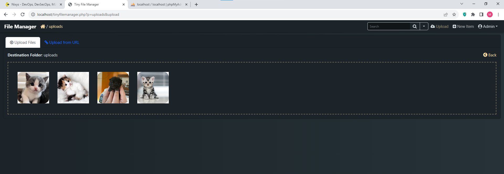
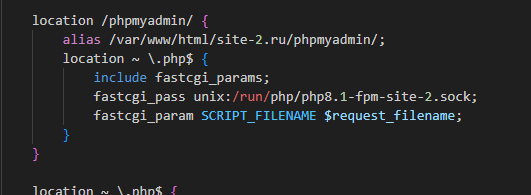
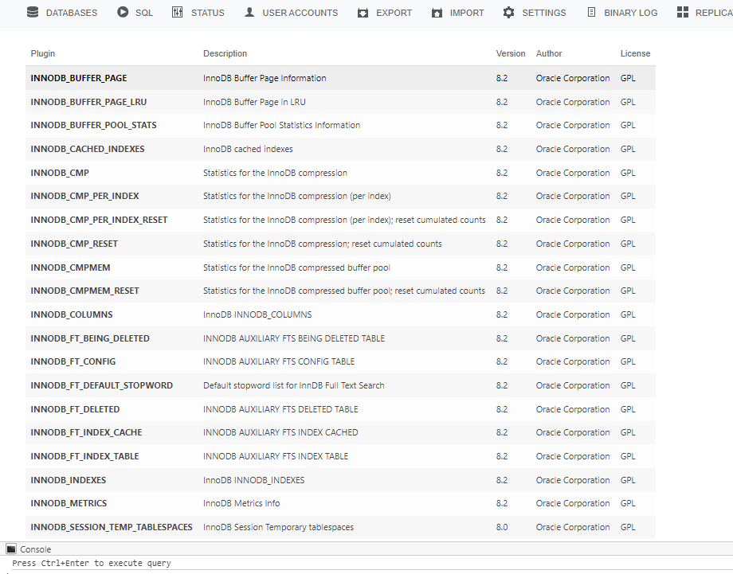

# Настройка сервисов для сервера

## Разница между модификацией и оригиналом конфигураций

Чтобы увидеть разницу и внесенные изменения в файлы конфигурации, можно запустить скрипт diff.sh:

- bash diff.sh

# Настройка площадок сайтов

### Площка для сайта site.ru

1. Настроена связка Nginx+Apache2+PHP+MySQL для работы сайта site.ru.

2. Установка CMS Битрикс.

3. Настроен веб-сервер таким образом, чтобы статические данные, такие как изображения, видео и gif, обрабатывались Nginx, а все остальные данные передавались на обработку Apache2.

4. Настроены минимально необходимые права на площадку для сайта.

### Площадка для сайта site-2.ru

1. Настроена связка Nginx+php-fpm для работы сайта site-2.ru.

2. Предусмотрена возможность переключения между версиями PHP через разные пулы fpm.

3. Сайт работает от пользователя site-2.ru.

4. Установлен файл менеджер на PHP на площадке для загрузки и удаления файлов.

## Настройка phpMyAdmin как алиас

1. phpMyAdmin настроен работать для любого сайта сервера путем добавления /phpmyadmin к URL сайта (PMA как алиас) и статические данные отдаются веб-сервером Nginx.

2. Обеспечена работа phpMyAdmin без ошибок и предупреждений и возможность управления базами данных MySQL на сервере для обоих сайтов.

*На site-2.ru*

*По порту 81 (Apache2) на site.ru*

3. Обеспечена возможность работы "дополнительных возможностей" PMA.

## Задание выполнено в операционной системе Ubuntu.